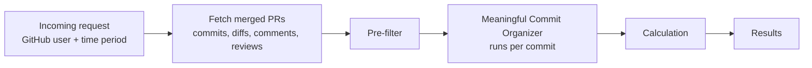

# PR Project

Measures how much meaningful work a GitHub user put into their merged pull requests over a review period, and how much impact their code reviews had.

Instead of counting raw commits or lines, every commit is sorted into a bucket (lint/config, WIP, testing, addressed comments, meaningful) so that formatting passes, throwaway work, and reverted changes don't inflate the score.

**Design diagram:** [Figma board](https://www.figma.com/board/2dmzwu1JJKPzuoWVXgia8W/PP?node-id=0-1)

## How it works



### 1. Fetch
Pulls every PR the user merged in the time window, along with each PR's commits (with diffs), comments, reviews, and merge commit.

### 2. Pre-filter
Removes commits that shouldn't be analyzed at all:
- **Simple:** merge commits, empty commits, lockfile-only commits, bot commits
- **Revert pairs:** a commit whose diff is at least 90% the inverse of an earlier commit is paired with it, and both count as zero. In a commit → revert → recommit chain, only the recommit counts.

### 3. Meaningful Commit Organizer
Each remaining commit goes through these steps in order and stops at the first one that assigns a bucket:

| Step | Check | Bucket |
|---|---|---|
| 1. Size & lint | Config-only files, tiny diffs, lint keywords, whitespace-only changes | Lint/Config |
| 2. WIP flag | WIP/temp keywords in the message, placeholder-only lines (`TODO`, `pass`, ...). Only sets flags | — |
| 3. Test check | Most changed lines are in test files, with no major non-test changes | Testing |
| 3.5. Conversation | A reviewer requested changes before the commit and approved after it | Addressed Comments |
| 4. Lint by content | Comment-only or formatting-only changes | Lint/Config |
| | Step 2 placeholder flag confirmed, or under half the added lines survive into the final PR | WIP |
| AI | Claude judges whether the commit is a meaningful design change or creation | Any bucket |

### 4. Calculation
```
score = meaningful × 3 + addressed comments + testing
      + (additions × 1.5 + deletions) × 0.01      # lines from meaningful commits
```

### 5. Results
- Top ranked PRs, with each PR's percentile
- Number of meaningful PRs (scoring at or above the 75th percentile)
- Totals per bucket and per pre-filter reason

## Files

| File | What it does |
|---|---|
| `PRs.py` | The pipeline above. Run it for PR scores. |
| `reviews.py` | Code reviews the user gave: total reviews, approvals, and whether their feedback was acted on. |
| `config.py` | Environment setup, keywords, thresholds, scoring weights, and a rate-limited GitHub request helper. |

## Setup

```bash
pip install requests python-dotenv anthropic pydantic
```

Create a `.env` file:

```
GITHUB_TOKEN=your_github_token
USERNAME=github_username_to_analyze
AI_API_KEY=your_anthropic_api_key

# review period (YYYY-MM-DD). If omitted, the last LOOKBACK_DAYS days are used (default 90)
START_DATE=2026-01-01
END_DATE=2026-06-30
```

## Usage

```bash
python PRs.py       # PR scores and commit buckets
python reviews.py   # code review impact
```

Thresholds and weights (test share, survival ratio, percentile cutoff, and so on) are in `config.py`.
